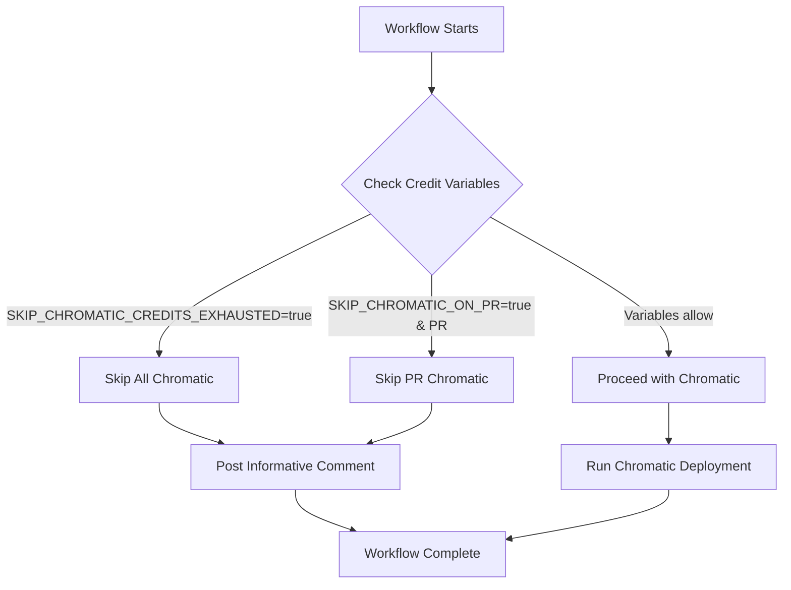

# Storybook Deployment Fixes

## 🔧 Issues Fixed

### 1. **Storybook Build Configuration**
- **Issue**: `No story files found for the specified pattern: src/stories/**/*.mdx`
- **Solution**: Removed unnecessary `.mdx` pattern from Storybook configuration since project only uses `.stories.tsx` files
- **File Modified**: `.storybook/main.ts`

### 2. **Chromatic Credit Management**
- **Issue**: User requested ability to skip Chromatic deployment when monthly free credits are exhausted
- **Solution**: Implemented comprehensive credit management system in GitHub Actions workflow
- **File Modified**: `.github/workflows/chromatic.yml`

## 🎯 New Features

### Chromatic Credit Limit Management

The updated workflow now includes intelligent credit management:

#### **Repository Variables for Control**
Set these in `Settings > Secrets and variables > Actions > Variables`:

1. **`SKIP_CHROMATIC_CREDITS_EXHAUSTED`** (true/false)
   - When `true`: Skips ALL Chromatic deployments
   - Use when monthly credits are completely exhausted
   - Default: `false`

2. **`SKIP_CHROMATIC_ON_PR`** (true/false)
   - When `true`: Skips Chromatic on Pull Requests only
   - Preserves credits for main branch deployments
   - Default: `false`

#### **Automatic Behavior**
- ✅ **Main Branch**: Always gets priority for Chromatic deployment
- ✅ **Pull Requests**: Can be selectively disabled to conserve credits
- ✅ **Credit Status**: Automatically posts informative comments on PRs
- ✅ **Manual Override**: Easy variable updates to resume deployments

### Credit Management Workflow



## 📋 Usage Instructions

### When Credits Are Exhausted

1. **Immediate Action**: Set repository variable
   ```
   SKIP_CHROMATIC_CREDITS_EXHAUSTED = true
   ```

2. **Conservative Approach**: Skip only PR deployments
   ```
   SKIP_CHROMATIC_ON_PR = true
   ```

3. **Monthly Reset**: Update variables at month start
   ```
   SKIP_CHROMATIC_CREDITS_EXHAUSTED = false
   SKIP_CHROMATIC_ON_PR = false
   ```

### Monitoring Credit Usage

1. **Chromatic Dashboard**: Visit [chromatic.com](https://www.chromatic.com/) to check usage
2. **GitHub Actions**: Check workflow logs for credit consumption patterns
3. **PR Comments**: Automatic comments provide credit status information

### Manual Testing When Chromatic is Disabled

When Chromatic is skipped, use local testing:

```bash
# Start Storybook locally
npm run storybook

# Test build process
npm run build-storybook

# Verify specific components
npm run debug:chromatic
```

## 🔄 Workflow Logic

### Current Behavior

1. **Credit Check**: First step checks repository variables
2. **Conditional Execution**: All subsequent steps only run if credits allow
3. **Informative Messaging**: Clear communication about why Chromatic was skipped
4. **PR Comments**: Automatic comments explain status and provide guidance

### Fallback Strategy

- **Primary**: GitHub Pages deployment always continues (independent of Chromatic)
- **Secondary**: Manual testing instructions provided when Chromatic is disabled
- **Tertiary**: Debug tools available for local component validation

## 🚀 Benefits

1. **Cost Control**: Prevent unexpected Chromatic credit overages
2. **Flexible Management**: Multiple control levels (all, PR-only, none)
3. **Clear Communication**: Automated status updates and instructions
4. **Zero Disruption**: Storybook deployment continues regardless of Chromatic status
5. **Easy Recovery**: Simple variable updates to resume full functionality

## 📊 Credit Optimization Strategies

### Immediate Savings
- Skip Chromatic on draft PRs ✅ (already implemented)
- Skip Chromatic on WIP branches using `SKIP_CHROMATIC_ON_PR=true`
- Auto-accept changes on main branch ✅ (already implemented)

### Long-term Planning
- Monitor usage patterns in Chromatic dashboard
- Consider upgrading to paid plan for unlimited credits
- Optimize story count and complexity to reduce processing time

## 🔧 Troubleshooting

### If Deployment Still Fails

1. **Check Build Logs**: Look for specific error messages
2. **Test Locally**: Run `npm run build-storybook` locally
3. **Verify Dependencies**: Ensure all packages install correctly
4. **Check Variables**: Verify repository variables are set correctly

### If Chromatic Issues Persist

1. **Use Debug Script**: Run `npm run debug:chromatic` for analysis
2. **Check Token**: Verify `CHROMATIC_PROJECT_TOKEN` secret is valid
3. **Review Stories**: Look for problematic components or stories
4. **Test Individual Stories**: Isolate issues to specific components

## 📝 Next Steps

1. **Monitor**: Watch next few deployments for stability
2. **Optimize**: Adjust credit management strategy based on usage patterns
3. **Scale**: Consider Chromatic paid plan if visual testing is critical
4. **Document**: Keep team informed about credit management procedures

---

*This system provides complete control over Chromatic deployment costs while maintaining development workflow efficiency.*
